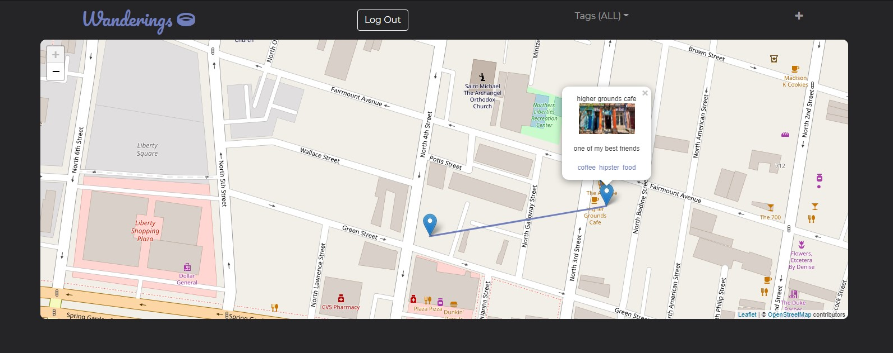
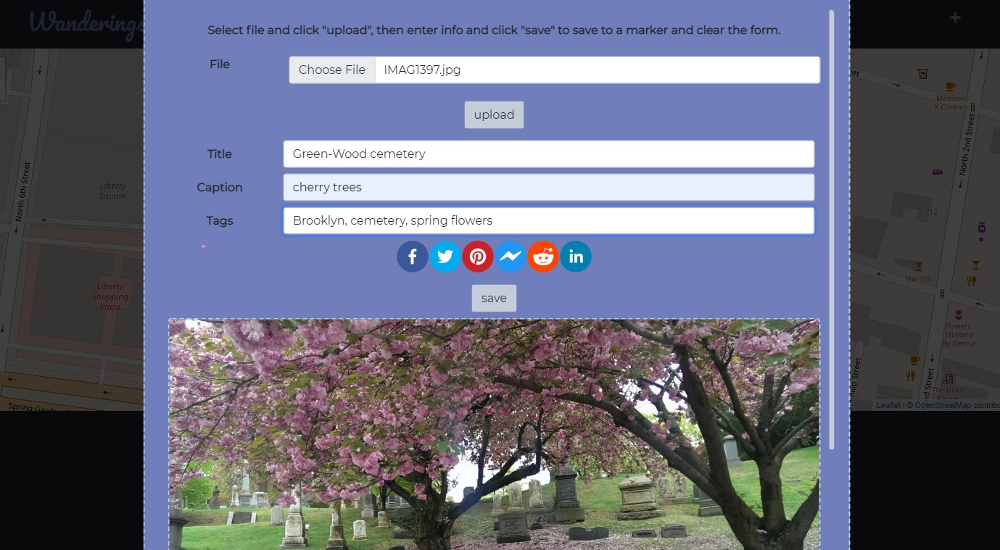

# Wanderings

## Coding Requirements
- Must use ReactJS in some way (even if minimal)
- Must use a Node and Express Web Server
- Must be backed by a MySQL or MongoDB Database with a Sequelize or Mongoose ORM
- Must have both GET and POST routes for retrieving and adding new data
- Must be deployed using Heroku (with Data)
- Must utilize at least two libraries, packages, or technologies that we haven’t discussed
- Must allow for or involve the authentication of users in some way
- Must have a polished frontend/UI
- Must have folder structure that meets MVC Paradigm
- Must meet good quality coding standards (indentation, scoping, naming)
- Must not expose sensitive API key information on the server

## Description
With Wanderings, one can add photos to the app and from the metadata a visual tour is created of where and when cool things happened. The user can then tag the photos based on how they want the moments remembered. This allows the user to curate lists and retrieve the moments as a group. For example: when the user finally summits the mountain they can tag it with “triumph” and the date. So later the user can see wandering trips by date or by feeling or by whatever. 

## Under the Hood
Wanderings is a MERN stack application--it uses [MongoDB](https://www.mongodb.com/1), [Express.js](https://expressjs.com/), [React](https://reactjs.org/), and [Node.js](https://nodejs.org/en/).  
  
- Maps are created using [Leaflet.js](https://leafletjs.com/) and [OpenStreetMap](https://www.openstreetmap.org/copyright).  
- Image hosting and metadata retrieval by [Cloudinary](https://cloudinary.com/)
- [bcrypt](https://www.npmjs.com/package/bcrypt) and [jwswebtoken](https://www.npmjs.com/package/jsonwebtoken) for user management
- [react-modal](https://www.npmjs.com/package/react-modal) for...well...modals
- [react-share](https://www.npmjs.com/package/react-share) for implementing share buttons and setting up link/text for default share content
- [coordinate-parser](https://www.npmjs.com/package/coordinate-parser) for massaging latitude/longitude data into a standard format
- Users, tags, and markers are all stored in a Mongo database with [MongoDB Atlas](https://www.mongodb.com/cloud/atlas/)

## Future Development
- Set up share buttons to route to unique, public links
- Add scoring system that rewards users for adding more data
- Add social component that allows users to rate whether a marker is helpful or not, adding to user score
- Add a fog of war component that unlocks portions of the map as a user adds more markers

## Link, Demo, Screenshots
[Link to Deployed Apllication](https://wanderings-project.herokuapp.com/)

## Credits
Artemis - Cloudinary and upload form, share buttons, UI design  
J - Leaflet, Map logic, dropdown, user context, project management  
Sean - Express, Node, and Mongoose setup, initial models, apis and routing
